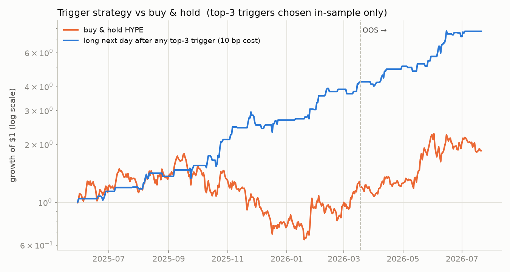
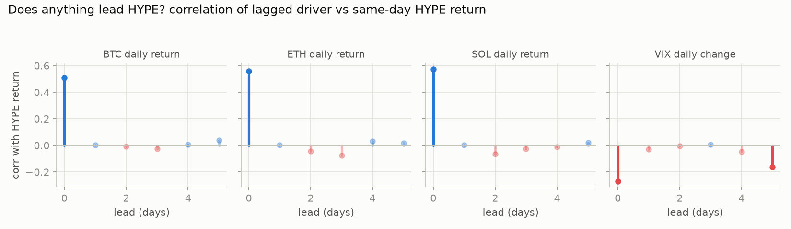
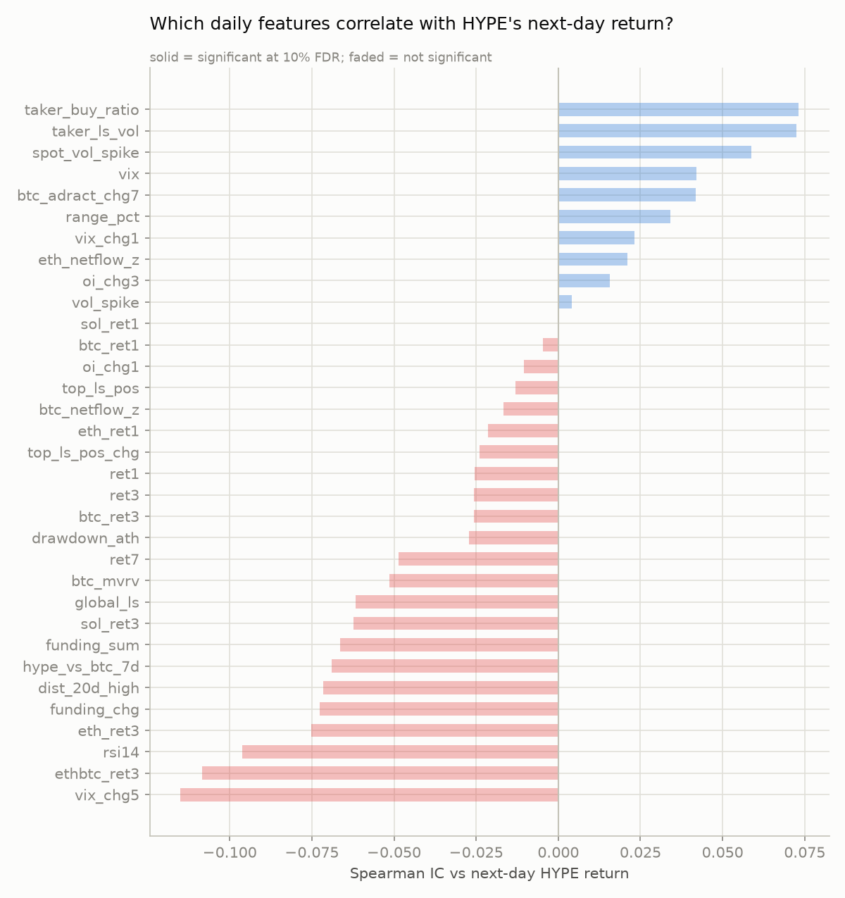
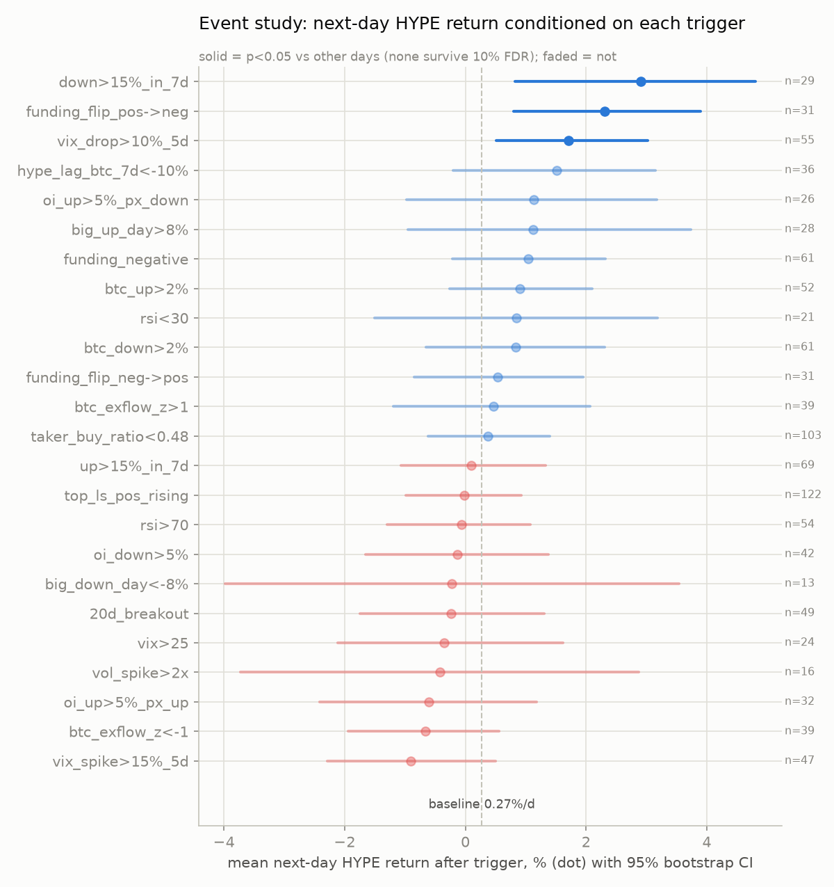

# What triggers HYPE price up? — a backtested correlation study

**Window:** 2025-05-30 → 2026-07-21 (418 daily observations, UTC days)
**Price series:** Binance USD-M HYPEUSDT perp (validated 0.996 daily-return
correlation against CoinMetrics' HYPE reference rate on the overlap window).
**Baseline:** HYPE averaged **+0.27%/day** over the window with ~95% annualized
volatility — every conditional result below is measured against that baseline.

## TL;DR — the three triggers that actually preceded HYPE up-moves

| Trigger (evaluated at day close) | Next-day return | Win rate | N | t-stat |
|---|---|---|---|---|
| **HYPE down >15% over the past 7d** (capitulation dip) | **+2.90%** | 76% | 29 | 2.64 |
| **Funding flips positive → negative** (longs flushed, shorts paying) | **+2.31%** | 65% | 31 | 2.63 |
| **VIX drops >10% over 5d** (macro risk-on, SPX rallying) | **+1.71%** | 64% | 55 | 2.38 |

All three are **mean-reversion / washed-out-positioning signals plus macro
risk appetite** — not breakout signals. A strategy that goes long HYPE the day
after any of these fires (chosen on the first 70% of the sample only, 10 bp
round-trip cost) held up out-of-sample on the final 30%:

| Rule | Window | Days in market | Total return | Sharpe | Max DD |
|---|---|---|---|---|---|
| Union of top-3 triggers | In-sample | 74/292 | +321% | 3.70 | −21% |
| Union of top-3 triggers | **Out-of-sample** | 34/126 | **+84%** | **3.97** | **−8%** |
| Buy & hold | Out-of-sample | 126 | +45% | 1.65 | −29% |



## What does NOT trigger HYPE up (popular beliefs that failed)

- **Breakouts don't follow through:** a 20-day-high breakout averaged
  −0.23%/day next day (below baseline). RSI>70: −0.07%/day.
- **Rising open interest with rising price** (fresh longs piling in) was
  *negative*: −0.61%/day next day. The bullish OI pattern was the opposite —
  OI up while price falls (shorts building → squeeze fuel): +1.14%/day.
- **Volume spikes alone are not bullish on a daily horizon:** vol >2× the
  14-day average → −0.42%/day. (Intraday is different — see below.)
- **Top-trader long/short ratio rising** — flat (−0.02%/day, n=122).
- **Yesterday's BTC move does not predict today's HYPE move.** The BTC/ETH/SOL
  relationship is contemporaneous (same-day corr 0.51 / 0.56 / 0.57) with no
  usable 1-day lead. The only macro series with a multi-day *lead* was the VIX
  (corr −0.27 same-day, still −0.16 at a 5-day lead).



## Continuous correlations (Spearman IC vs forward returns)

The strongest and most stable relationships over 3–7-day horizons:

| Feature | IC vs fwd 3d | IC vs fwd 7d | Read |
|---|---|---|---|
| `funding_sum` (daily funding) | −0.10 (p=.04) | **−0.21 (p=.0004)** | High funding → weak week ahead; negative funding → strong |
| `rsi14` | **−0.17 (p=.001)** | **−0.20 (p=.00005)** | Overbought fades, oversold recovers — HYPE mean-reverts |
| `vix_chg5` | **−0.16 (p=.001)** | −0.07 | Falling equity vol (risk-on) → HYPE up over the next days |
| `dist_20d_high` | −0.12 (p=.02) | −0.13 (p=.008) | Nearer the 20d high → worse forward returns |
| `ethbtc_ret3` | −0.14 (p=.005) | −0.15 (p=.002) | After ETH outruns BTC 3d, HYPE tends to cool |
| `hype_vs_btc_7d` | −0.10 (p=.04) | −0.11 (p=.02) | HYPE lagging BTC catches up (and vice versa) |

At the strict 10% false-discovery-rate bar, the 1-day-ahead ICs are not
individually significant (418 days is a short sample); the 3–7-day ICs for
`rsi14` and `funding_sum` are the most statistically solid results in the
study. Direction is consistent across horizons and with the event studies.




## Intraday: the spike signal this repo's bot trades, tested on HYPE

Using 1h HYPEUSDT bars (10,022 bars), spike = |1h move| ≥3% and volume ≥3× the
prior-10h average — i.e. `growhf_reactive_bot`'s signal:

| Event | N | fwd 1h | fwd 24h | Read |
|---|---|---|---|---|
| Up-spike ≥3% **with** ≥3× volume | 20 | **+0.64%** (65% win, t=2.0) | +2.07% | Volume-confirmed spikes continue |
| Up-spike ≥3% **without** volume | 74 | −0.06% | +0.78% | No volume → no edge |
| Down-spike ≤−3% with ≥3× volume | 20 | +0.63% | +1.21% | High-volume flushes bounce |
| Down-spike ≤−3% without volume | 53 | +0.44% | **−1.82%** (t=−2.7) | Low-volume bleeds keep bleeding |

The bot's volume-confirmation requirement is doing real work on HYPE: the
same 3% price move means opposite things with and without the volume surge.

## The coherent story

HYPE up-moves in this sample were triggered by **washed-out conditions, not
strength**: a 7-day capitulation, funding flipping negative (shorts crowded /
longs liquidated), lagging BTC by >10%, or OI building into falling prices —
each followed by above-baseline forward returns. The macro overlay matters in
the direction the SPX/VIX dashboards suggest: **equity risk-on (VIX falling
hard) front-runs HYPE strength by several days**, while VIX spikes precede
weakness. Chasing strength (breakouts, high RSI, longs piling in) had zero or
negative edge at the daily horizon; the only chase that worked was intraday
volume-confirmed spikes.

## Method & honesty notes

- All features are computed at day *t*'s close using only information
  available by then; forward returns start at the same close (no lookahead).
- 26 binary triggers were tested; **none individually clears a 10% FDR**
  correction on next-day returns — with ~420 days that bar is very high. The
  case for the top-3 rests on (a) p≈0.01–0.02 individually, (b) internal
  consistency with the continuous ICs (which *are* FDR-significant at 3–7d
  for rsi14/funding), and (c) out-of-sample survival of a rule frozen on the
  first 70% of data.
- 3d/7d event stats use overlapping windows — treat their t-stats as
  indicative, not exact.
- The linked dashboards' native feeds (Hypurrscan stats, HypeStrat
  staking/assistance-fund buybacks, HLP vault whale flows) are not reachable
  from this environment's network policy; funding + open interest + long/short
  + taker-flow from Binance futures and VIX (as the SPX risk proxy for the
  TradingView link) are the closest tradeable stand-ins. Adding
  assistance-fund buyback and staking-flow series is the natural next step if
  those APIs are opened up.
- Strategy results assume 10 bp round-trip cost, no funding paid/earned while
  in position, and next-day close-to-close fills.

## Reproduce

```bash
cd research/hype_correlations
pip install pandas numpy scipy matplotlib requests
python fetch_data.py      # ~600 public files: Binance S3, CoinMetrics, VIX
python build_dataset.py   # -> data/hype_daily_dataset.csv, data/hype_1h.csv
python backtest.py        # -> results/*.csv, results/*.png
```

Raw per-file downloads land in `data/raw/` (gitignored); the merged daily
dataset and 1h series are committed so results are reproducible as-is.
